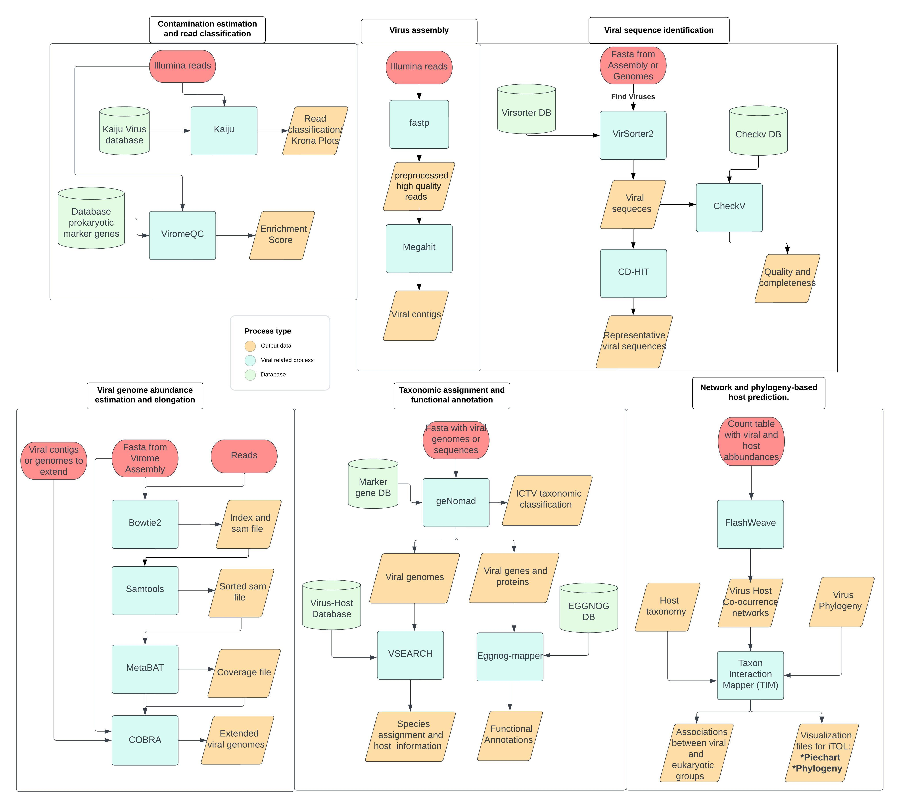

<br>
# ViromeXplore
> "Nextflow workflows for the analysis and discovery of viral sequences from metagenomes and viromes"
<br>


**ViromeXplore** conatains a set of bioinformatic workflows that can be used reproducibly, sequentially and interoperably between them and with other workflows. It allows multiple input types mand starting points that include **raw reads**, **contigs**, **genomes**, **abbundance tables**, **phylogenies** and **taxonomies**.
ViromeXplore contains the most varied and comprehensive workflows to explore viral genes and genomes from viromes and metagenomes to date. The future aim for ViromeXplore is to continue expanding the workflows and including the most recent and efficient tools.

The workflows are implemented in [Nextflow](https://www.nextflow.io/), and additionally only [Docker](https://www.docker.com/) or [Singularity](https://docs.sylabs.io/guides/3.0/user-guide/quick_start.html) are needed to run ViromeXplore. Installation and usage details are provided below.


## :twisted_rightwards_arrows: Workflows 
ViromeXplore contains the following workflows that can be used in different combinations according to the user’s needs:

- `Contamination estimation and read classification.`
- `Virus assembly.`
- `Viral sequence identification.`
- `Viral genome abundance estimation and elongation.`
- `Taxonomic assignment and functional annotation.`
- `Network and phylogeny-based host prediction.`

A detailed representation of the workflows is shown in the diagram below.


<br>

## :floppy_disk: Installation

The workflows require [Nextflow](https://www.nextflow.io/docs/latest/getstarted.html) and either [Singularity](https://docs.sylabs.io/guides/3.0/user-guide/installation.html) (default) or [Docker](https://docs.docker.com/get-docker/) to be executed. To install this software, use the commands below. Alternatively, they can be installed using Conda, although this method is not recommended.


### 1. Install Nextflow
```bash
curl -s https://get.nextflow.io | bash
sudo mv nextflow /usr/local/bin/
nextflow -version
```

### Install Docker
```bash
sudo apt-get update
sudo apt-get install -y \
  ca-certificates curl gnupg lsb-release
curl -fsSL https://download.docker.com/linux/ubuntu/gpg | sudo gpg --dearmor -o /usr/share/keyrings/docker-archive-keyring.gpg
echo "deb [arch=$(dpkg --print-architecture) signed-by=/usr/share/keyrings/docker-archive-keyring.gpg] https://download.docker.com/linux/ubuntu $(lsb_release -cs) stable" | sudo tee /etc/apt/sources.list.d/docker.list > /dev/null
sudo apt-get update
sudo apt-get install docker-ce docker-ce-cli containerd.io
docker --version
```

### Install Singularity
```bash
export VERSION=3.10.3
wget https://github.com/sylabs/singularity/releases/download/v${VERSION}/singularity-${VERSION}.tar.gz
tar -xzf singularity-${VERSION}.tar.gz
cd singularity
./mconfig && make -C builddir && sudo make -C builddir install
singularity --version
```

## :computer: Running ViromeXplore
### Running the workflows

#### USAGE:

Run the workflows as follows:

```bash
nextflow viromics.nf --pipeline qc_classify --reads basename_{1,2}.fastq

nextflow viromics.nf --pipeline viral_assembly --reads basename_{1,2}.fastq

nextflow viromics.nf --pipeline find_viruses --contigs contigs.fasta

nextflow viromics.nf --pipeline high_quality_genomes --reads basename_{1,2}.fastq --contigs contigs.fasta --viral_contigs viral_contigs.fasta

nextflow viromics.nf --pipeline taxonomy_annotation --viral_contigs viral_contigs_or_genomes.fasta

nextflow viromics.nf --pipeline host_prediction --phylogeny viral_phylogeny.nwk --taxonomy host_taxonomy.tsv --matrix virus_host_abbundances.tsv
```

Containers are available for all processes. To launch a run, use Singularity (default) or Docker by specifying the appropriate profile:

- For Docker: use `-profile docker`
- For Singularity: use `-profile singularity`

Depending on the cluster system it is also possible to use slurm in the profile which enables the user to configure the resources for each step. For this the user should modify the **`config/local.config`** file and run the profile as follows:

`-profile singularity,slurm`
`-profile docker,slurm`


Include the selected profile option when running the workflow script.


#### MANDATORY ARGUMENTS:

- `--pipeline`  
  Valid pipeline name:  
  `[qc_classify / viral_assembly / find_viruses / high_quality_genomes / taxonomy_annotation / host_prediction]`

##### For the `qc_classify` and `viral_assembly` pipelines:
- `--reads`  
  Reads in FASTQ format:  
  `['basename_{1,2}.fastq']`

##### For the `find_viruses` and `annotate` pipelines:
- `--contigs`  
  Contigs file in FASTA format:  
  `['file.fasta']`

##### For the `high_quality_genomes` pipeline:
- `--reads`  
  Reads in FASTQ format:  
  `['basename_{1,2}.fastq']`
- `--contigs`  
  Contigs file obtained from assembly:  
  `['file.fasta']`
- `--viral_contigs`  
  Viral classified contigs or genomes to extend:  
  `['file.fasta']`

##### For the `taxonomy_annotation` pipeline:
- `--viral_contigs`  
  Viral classified contigs or genomes:  
  `['file.fasta']`

##### For the `host_prediction` pipeline:
- `--phylogeny`  
  Phylogenetic tree for the viruses being analyzed (NEWICK format):  
  `['virus_phylogeny.nwk']`
- `--taxonomy`  
  Lineage of host in NCBI terms (TAB DELIMITED file with ID and lineage):  
  `['taxonomy_file.tsv']`
- `--matrix`  
  Matrix containing the abundances of viruses and hosts (TAB DELIMITED):  
  `['matrix_abundances.tsv']`  
  *(Columns correspond to taxa and rows to samples).*

#### OPTIONAL ARGUMENTS:
- `--result_dir`  
  Name of directory where the results from all analyses will be written.  
  *[default: results]*
- `--cpus`  
  Number of CPUs to use during the job.  
  *[default: all available]*
- `--memory`  
  Memory in GB to be assigned for the job.  
  *[default: 12 GB]*
- `--help`  
  Help statement.

#### PIPELINES:

- **qc_classify**  
  Pipeline to detect non-viral contamination and viral read classification.  
  *(ILLUMINA files required)*

- **viral_assembly**  
  Pipeline for virome read QC and assembly.  
  *(ILLUMINA files required)*

- **find_viruses**  
  Pipeline for viral sequence identification and annotation.  
  *(FASTA contig file required)*

- **high_quality_genomes**  
  Pipeline for obtaining viral contig abundance and improving genomes.  
  *(FASTA contig file required, FASTA viral contig file required, ILLUMINA files required)*

- **taxonomy_annotation**  
  Pipeline for assigning viral contigs/genomes taxonomy and gene annotations.  
  *(FASTA viral contig/genome file required)*

- **host_prediction**  
  Pipeline to determine virus-host pairs using co-occurrence and phylogeny.  
  *(ABUNDANCE tsv matrix, PHYLOGENY newick tree, HOST TAXONOMY NCBI terms and host ID required)*

## ✒️ Citing ViromeXplore
If you have used the ViromeXplore please consider citing:
