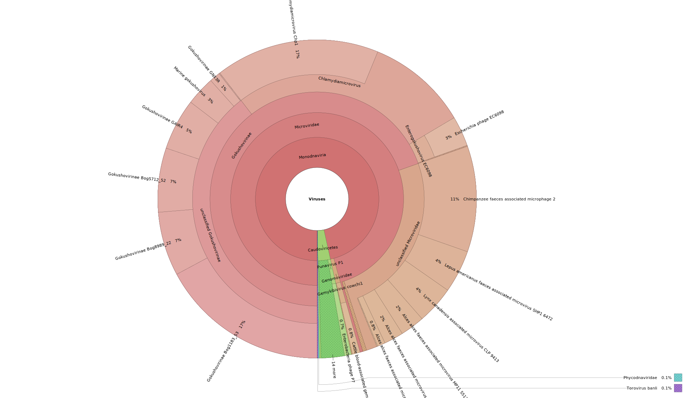
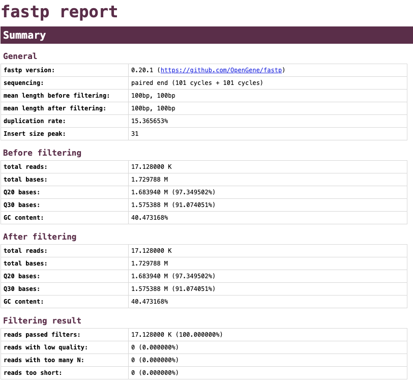

Tutorial: Analyzing a Virome Dataset with ViromeXplore
=======================================================

The following tutorial uses a 10,000 read subset of a virome from the human gut (SRR829034).  The aim of this tutorial is that the user learns to use the workflows contained in the ViromeXplore software. The demo dataset is automatically downloaded with the github repo.

Quality Control and Classification
------------------------------------------

Run the following command to perform quality control and viral classification:

.. code-block:: bash

    nextflow ViromeXplore.nf --pipeline qc_classify --reads "demo/demo_SRR829034_{1,2}.fastq"

The interactive Krona plot can be viewed here:

`View interactive Krona plot <_static/demo_SRR829034.html>`_

The ViromeQC results show an enrichment score of **2.26**, indicating that the virome is **2.8×** more enriched than a comparable metagenome.

---

Viral Assembly
----------------------

Assemble the viral reads:

.. code-block:: bash

    nextflow ViromeXplore.nf --pipeline viral_assembly --reads "demo/demo_SRR829034_{1,2}.fastq"

`View interactive  plot <_static/demo_SRR829034_fastp.html>`_

The fatsp report shows that the Q30 of most bases was above 30 so no reads were removed.

This workflow also creates an **assembly fasta file** with genomic contigs. 
A quick inspection revealed a total of 27 contigs.

Identify Viral Sequences
--------------------------------

Run the viral identification workflow on the assembled MAGs:

.. code-block:: bash

    nextflow ViromeXplore.nf --pipeline find_viruses --contigs results/megahit_output/final.contigs.fa

**Virsorter2 Results**:
- 3 sequences classified as viral
- 2 = dsDNA phages
- 1 = ssDNA virus

Refer to the following table for more details:

.. include:: _static/final-viral-score.rst

**Check Viral Genome Quality**

Results for CheckV:

- 2 dsDNA viruses: High quality (100% complete)
- ssDNA virus: 55% complete

.. include:: _static/completeness.rst

---

Extend Incomplete Genomes
----------------------------------------

.. code-block:: bash

    nextflow ViromeXplore.nf --pipeline high_quality_genomes \
      --reads "results/fastp_output/demo_SRR829034_{1,2}.fastp.fq.gz" \
      --contigs results/megahit_output/final.contigs.fa \
      --viral_contigs results/checkv_output/viruses.fna

Log output shows no extension was performed (expected for demo data):

.. code-block:: none

    [01/23] Reading contigs and getting the contig end sequences...
    [05/23] A total of 3 query contigs were imported.
    ...
    no query was extended, exit! this is normal if you only provide few queries.

---

Taxonomic Annotation
----------------------------

Since no high-quality genomes were obtained, we run taxonomy annotation directly on the viral contigs:

.. code-block:: bash

    nextflow ViromeXplore.nf --pipeline taxonomy_annotation \
      --viral_contigs results/checkv_output/viruses.fna

**Taxonomy Results**:
All viral genomese were successfully classified.
- Family: Microviridae

.. include:: _static/viruses_virus_summary.rst

**Functional Annotation**:
- The eggNOG analysis revealed proteins related to:
  - Structural molecule activity
  - ATP binding
  - Viral process

---

Directory structure
----------

Each pipeline step creates its own directory, keeping the workflow organized and reproducible, for example:

.. code-block:: text

   results/
   │
   ├── samtools_output/
   ├── megahit_output/
   ├── bowtie_output/
   ├── vsearch_output/
   ├── eggnog_mapper_output/
   ├── checkv_output/
   ├── viromeQC_output/
   ├── fastp_output/
   ├── geNomad_output/
   ├── virsorter_out/
   ├── cdhit_output/
   ├── mapping_summary_output/
   ├── kaiju_output/
   └── cobra_output/